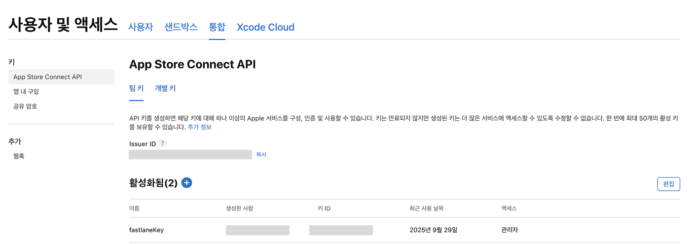
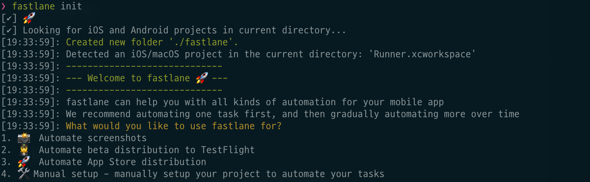
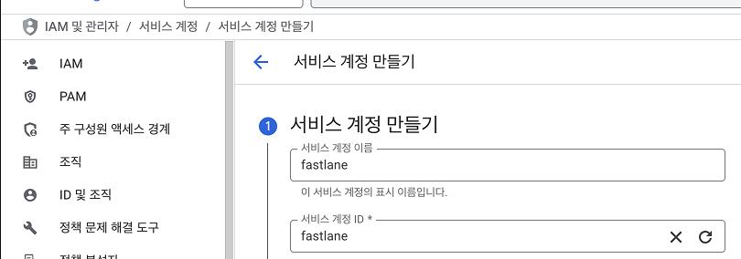
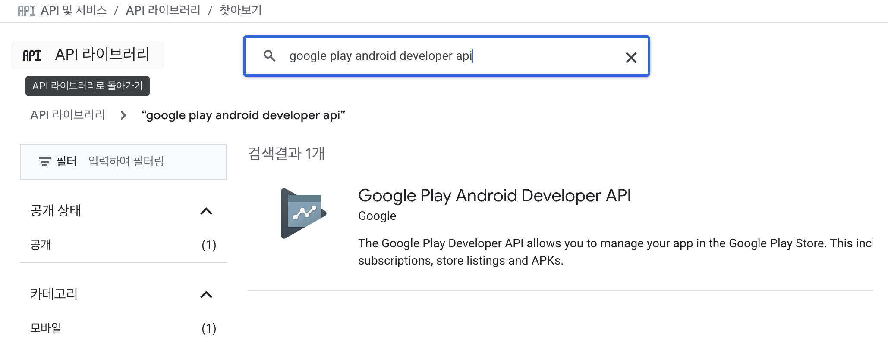
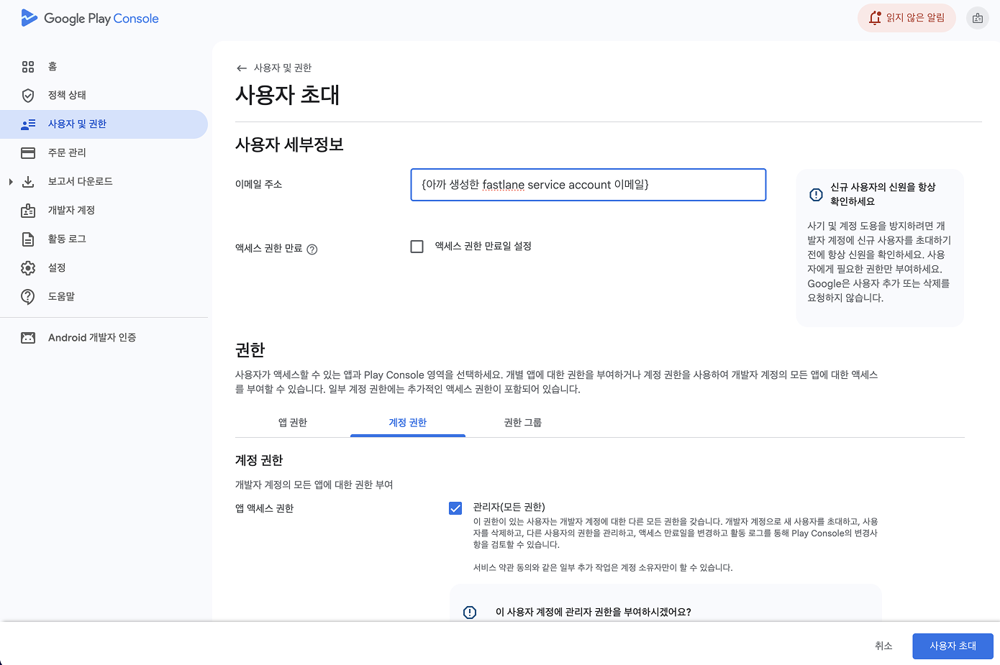
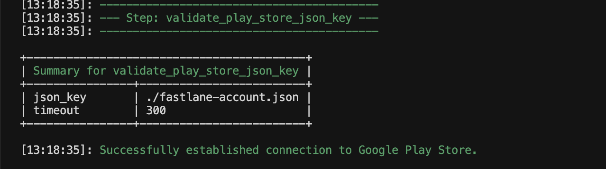

Flutter 앱 개발을 하다 보면 iOS, Android, 개발용(dev)와 배포용(prod) 빌드를 반복적으로 배포하는 과정이 꽤나 번거롭습니다.

이번 글에서는 fitf앱에서 Fastlane과 Shell Script를 활용하여 Flutter 빌드 및 배포 자동화 파이프라인을 구축하는 방법을 공유합니다.

# 폴더 구조

```sh,4-5&8-9&11-12
📦 Flutter Project
┣ 📂ios
┃ ┣ 📂fastlane
┃ ┃ ┗ 📜Fastfile
┃ ┣ 📜AuthKey_xxx.p8
┣ 📂android
┃ ┣ 📂fastlane
┃ ┃ ┗ 📜Fastfile
┃ ┣ 📜fastlane-account.json
┣ 📂scripts
┃ ┣ 📜deploy-dev.sh
┃ ┗ 📜deploy-prod.sh
┣ 📂libs
...
```

# 설치

```sh
brew install fastlane
or
sudo gem install fastlane
```

저는 `gem`을 사용하여 설치했습니다.

# iOS

공식 문서에서 가장 추천하는 방법인 `App Store Connect API`를 사용하여 설정합니다. 이를 위해서는 App Store Connect API key를 생성하고 fastlane에 이 키를 등록하여 자동적으로 배포가 가능하도록 지정해주는 순서로 진행합니다.

## App Store Connect API key 생성

App Store Connect API key는 [https://appstoreconnect.apple.com/access/integrations/api](https://appstoreconnect.apple.com/access/integrations/api) 에서 생성합니다.



생성한 키는 iOS 프로젝트 루트에 `AuthKey_xxx.p8` 파일로 저장 후 .gitignore에 추가해서 github나 gitlab에 올리지 않도록 합니다. Issuer_id와 키 ID는 Fastfile에 입력해야하기 떄문에 따로 저장해둡니다.

## fastfile 작성

```sh
cd ios/
fastlane init
```



Manual setup을 선택후 계속 진행하면 fastlane 폴더가 추가되고 Fastfile이 생성됩니다. 아래는 fitf 프로젝트의 Fastfile 예시입니다.

```ruby
default_platform(:ios)

platform :ios do
  before_all do
    ENV["SLACK_URL"] = "https://hooks.slack.com/services/{slack_webhook_url}"
  end

  after_all do |lane|
    slack(message: "Successfully deployed iOS App")
  end

  error do |lane, exception|
    slack(
      message: exception.message,
      success: false
    )
  end

  desc "Deploy TestFlight (DEV)"
  lane :deployTestFlightDev do
    build_app(
      workspace: "Runner.xcworkspace",
      scheme: "dev",
      xcargs: "-allowProvisioningUpdates"
    )

    upload_to_testflight(
      api_key: app_store_connect_api_key(
        key_id: "{key_id}",
        issuer_id: "{issuer_id}",
        key_filepath: "./AuthKey_{key_id}.p8",
      ),
      skip_waiting_for_build_processing: true
    )
  end

  desc "Deploy TestFlight (PROD)"
  lane :deployTestFlightProd do
    build_app(
      workspace: "Runner.xcworkspace",
      scheme: "prod",
      xcargs: "-allowProvisioningUpdates"
    )

    upload_to_testflight(
      api_key: app_store_connect_api_key(
        key_id: "{key_id}",
        issuer_id: "{issuer_id}",
        key_filepath: "./AuthKey_{key_id}.p8",
      ),
      skip_waiting_for_build_processing: true
    )
  end
end
```

iOS 스키마는 `dev`와 `prod`로 구성되어 있고 각 lane의 실행 전 ENV["SLACK_URL"]을 설정하여 내장 slack 함수에서 사용할 수 있도록 합니다. 또한 각 lane의 실행 후 slack 함수를 통해 성공 또는 실패 메시지를 전송합니다. 이 부분은 생략하셔도 상관없습니다.

그리고 각 스키마에 대한 lane을 작성합니다. lane들은 해당 스키마에 대한 빌드 및 배포를 담당합니다. 여기서 필요한
`key_id`와 `issuer_id`, `key_filepath`는 아까 저장해둔 정보들을 사용하여 Fastfile에 작성하면 iOS fastlane 설정은 끝입니다. `fastlane deployTestFlightProd` 명령어로 자동 빌드 및 배포를 진행할 수 있습니다.

# Android

Android 진행 과정은 `google cloud console` 에서 배포를 도와주는 Service Account를 생성, 배포를 위한 API를 활성화 해주고, `play console`에서 사용자 초대를 해주는 과정으로 이루어집니다.

## cloud console

먼저 [https://console.cloud.google.com/iam-admin/serviceaccounts/](https://console.cloud.google.com/iam-admin/serviceaccounts/) 에 접속하여 새로운 Service Account를 생성합니다. 이후 해당 Service Account의 JSON 키를 생성 후 다운로드 받아 Android 프로젝트 루트에 `fastlane-account.json` 파일로 저장 후 .gitignore에 추가해서 github나 gitlab에 올리지 않도록 합니다.



다시 [cloud console](https://console.cloud.google.com/) 에 접속하여 API 및 서비스 > + API 및 서비스 사용 설정 버튼으로 접속하여 `google play android developer api`를 검색하여 활성화 해줍니다.



## play console

[play console](https://play.google.com/console) 에 접속후 `사용자 및 권한` 탭에서 신규 사용자 초대 버튼 클릭 후 아까 생성한 Service Account의 이메일을 입력하고 `관리자` 역할을 부여해준후 사용자 초대를 클릭합니다. 그러면 자동적으로 해당 Service Account에 업로드 가능한 권한이 부여됩니다.



## fastfile 작성

그리고 Android 프로젝트 루트에서 fastlane init을 실행하여 Fastfile을 생성합니다. fastlane init 명령어를 실행하면 패키지명과 service account의 경로를 묻는데 설정해둔 패키지명과 아까 생성한 fastlane-account.json 파일을 경로를 입력해줍니다.

```sh
cd android/
fastlane init
com.example.app
./fastlane-account.json
```

이렇게 하고 나면 AppFile과 FastFile이 생성되고 AppFile에 패키지명과 service account 키 경로가 지정됩니다. service account 연결 테스트를 진행하려면 아래 명령어를 입력해보시면 됩니다

```sh
fastlane run validate_play_store_json_key
```



flutter에서 안드로이드 빌드시에는 저장위치가 프로젝트 루트에 생성되기 때문에 이에 맞는 fastfile을 작성해줍니다. 이 부분은 사용자 환경에 맞게 작성해주면 됩니다. flavor 적용된 경우와 안된 경우의 빌드 경로가 다르기 때문에 예시로 양 경우를 작성해보았습니다.

```ruby
default_platform(:android)

platform :android do
  # 안드로이드 빌드 및 배포 (flavor 적용 안된 경우)
  desc "Deploy PlayStore"
  lane :deployPlayStore do
    yaml_file_path = "../../pubspec.yaml"
    data = YAML.load_file(yaml_file_path)
    version_and_no = data["version"].split("+")
    version=version_and_no[0]
    no=version_and_no[1]

    Dir.chdir "../.." do
      sh("flutter", "build", "appbundle", "--release", "--build-number", no, "--build-name", version)
    end

    upload_to_play_store(
      track: "internal",
      release_status: "draft",
      skip_upload_metadata: true,
      skip_upload_images: true,
      skip_upload_screenshots: true,
      aab_paths: "../build/app/outputs/bundle/release/app-release.aab",
    )
  end

  # 안드로이드 빌드 및 배포 (flavor 적용)
  desc "Deploy PlayStore Prod"
  lane :deployPlayStoreProd do
    yaml_file_path = "../../pubspec.yaml"
    data = YAML.load_file(yaml_file_path)
    version_and_no = data["version"].split("+")
    version=version_and_no[0]
    no=version_and_no[1]

    Dir.chdir "../.." do
      sh("flutter", "build", "appbundle", "--release", "--build-number", no, "--build-name", version, "--flavor", "prod")
    end

    upload_to_play_store(
      track: "production",
      release_status: "draft",
      skip_upload_metadata: true,
      skip_upload_images: true,
      skip_upload_screenshots: true,
      aab_paths: "../build/app/outputs/bundle/prodRelease/app-prod-release.aab",
    )
  end
end
```

# Shell Script 작성

매번 배포시 iOS, Android 따로 명령어를 치기 귀찮기 때문에 한번에 진행할 수 있는 Shell Script를 작성해보겠습니다. 프로젝트 루트에 scripts 폴더를 생성하고 deploy-prod.sh 파일을 생성하여 아래와 같이 작성해줍니다.

```sh
# Deploy ios
cd ios
fastlane deployTestFlightProd

# Deploy android
cd ../android
fastlane deployPlayStoreProd
```

이렇게 생성후 프로젝트 루트 터미널에서 ./scripts/deploy-prod.sh 커맨드를 입력하면 iOS, Android 한번에 배포가 진행됩니다.
