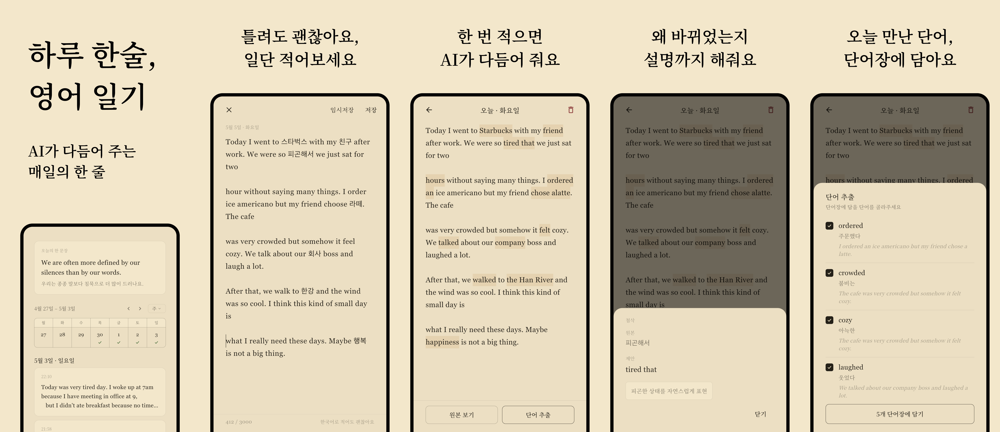

## 영어, 외우지 말고 써보세요

문법책을 펼치는 대신 오늘 있었던 일을 영어로 적어보세요. 한술은 **매일의 영어 일기와 AI 첨삭으로 자연스러운 표현을 익히는 앱**입니다.

서툴게 적어도 괜찮습니다. 어색한 표현은 AI가 자연스럽게 다듬어줍니다.

---

## 부담 없이, 그러나 충분히

무료로 매일 1,000자, Plus로는 3,000자까지 일기를 쓸 수 있어요.

오늘 하루의 짧은 메모도, 한 편의 긴 회고도 모두 같은 에디터 안에서 적어내려갈 수 있습니다. 글자 수 카운터가 조용히 따라오고, 분량에 대한 압박은 없어요.

---

## 문장 단위로 다듬어 줘요

작성한 글은 segment 단위로 분석돼, 어색한 표현 위에 자연스러운 대안과 짧은 한국어 노트가 인라인 하이라이트로 표시됩니다.

탭하면 원본·제안·왜 바뀌었는지 이유까지 한눈에 볼 수 있어요. 단순히 고쳐주는 데서 멈추지 않고, 다음에 같은 표현을 떠올릴 수 있도록 맥락을 함께 짚어드립니다.

---

## 매일의 영감

오늘의 영어 한 문장이 일기 위에 놓여요. 모든 사용자가 같은 날 같은 문장을 만나고, 마음에 드는 표현은 단어장에 저장해 곱씹을 수 있습니다.

문법, 핵심 단어, 한국인이 자주 틀리는 포인트까지 함께 분석해드려요.

---

## 단어가 쌓이는 단어장

일기와 분석 화면에서 마음에 든 단어를 저장하면, 처음 만난 문장 그대로 단어장에 들어가요.

단어가 어떤 맥락에서 쓰였는지 함께 보이니, 잊혀도 다시 떠올릴 수 있습니다.

---

## 한 호흡 쉬어 가는 톤

크림색 배경과 명조체 글꼴로 학원 톤이 아닌 종이 위에 쓰는 듯한 분위기를 만들었어요. 게임화·뱃지·점수 없이, 오늘의 일기를 쓰는 일에만 집중할 수 있습니다.

매일의 알림도 조용한 권유형 문구 중에서 직접 고를 수 있어요.

---

## 지금 시작하세요

무료로 시작하고, 매일 무제한 첨삭과 AI 맞춤 예문이 필요하다면 한술 더(Plus)로 업그레이드하세요.

- [App Store에서 다운로드](https://apps.apple.com/kr/app/id6766073114)
- [Google Play에서 다운로드](https://play.google.com/store/apps/details?id=com.appstdo.hansul)
