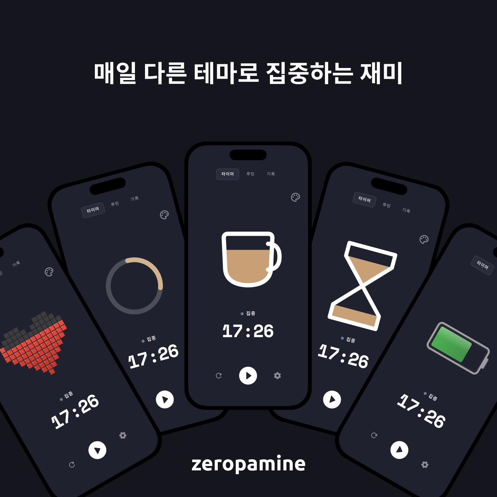
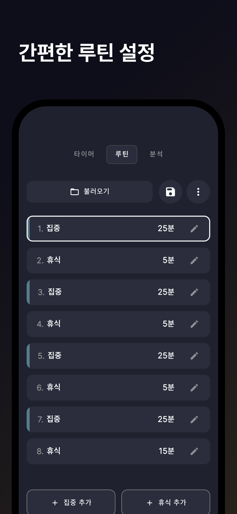
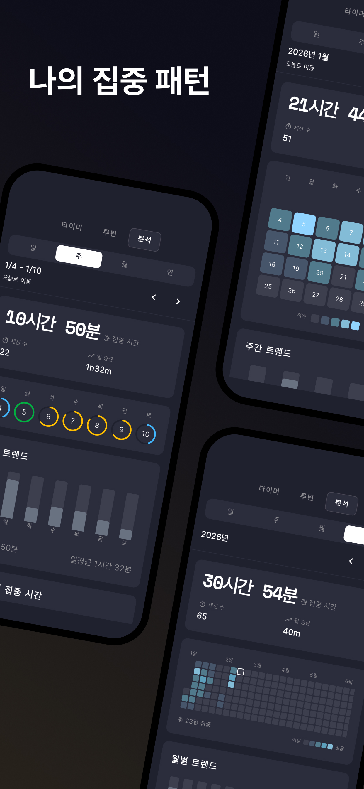

## 집중이 필요한 순간, 제로파민

끊임없이 쏟아지는 알림과 콘텐츠 속에서 진정한 집중은 점점 어려워지고 있습니다. 제로파민은 **도파민 과잉 시대에 깊은 몰입을 되찾고 싶은 분들**을 위해 만들어졌습니다.

단순히 시간을 재는 것을 넘어, 아름다운 애니메이션과 함께 집중하는 시간 자체를 즐거운 경험으로 바꿔드립니다.

---

## 나만의 루틴 만들기

기본 뽀모도로(25분 집중 + 5분 휴식)가 맞지 않으신가요?

집중 시간과 휴식 시간을 자유롭게 설정하고, 나만의 루틴을 만들어보세요. 딥워크가 필요한 날엔 50분 집중, 가볍게 시작하고 싶은 날엔 15분 집중. 오늘의 컨디션에 맞게 조절할 수 있습니다.

---

## 어디에 시간을 쓰고 있나요?

공부, 업무, 운동, 독서 등 카테고리별로 집중 시간을 기록하고 통계로 확인하세요.

"이번 주에 공부에 얼마나 집중했지?"
한눈에 확인할 수 있습니다.

---

## 여러 기기에서 이어서

Google 또는 Apple 계정으로 로그인하면, 아이폰에서 시작한 집중 기록을 아이패드에서 이어볼 수 있습니다. 설정, 루틴, 모든 기록이 자동으로 동기화됩니다.

  

---

## 집중을 방해하지 않는 디자인

어두운 배경과 미니멀한 인터페이스로 눈의 피로를 줄이고, 오직 집중에만 몰입할 수 있도록 설계했습니다. 타이머가 돌아가는 동안 화면이 꺼지지 않아, 언제든 남은 시간을 확인할 수 있습니다.

  

---

## 지금 시작하세요

무료로 시작하고, 더 많은 테마와 기능이 필요하다면 Pro로 업그레이드하세요.

- [App Store에서 다운로드](https://apps.apple.com/kr/app/id6756612361)
- [Google Play에서 다운로드](https://play.google.com/store/apps/details?id=com.appstdo.zeropamine&hl=ko)
